## ‍ 👪 팀원소개

- 팀명 : 상원없는 상원팀
- 팀원 소개

| 이름 | 직책 | 역할
| --- | --- | --- |
| 김상원 | 팀장 | Backend, QA |
| 명도균 | 팀원 | Frontend, 기획 |
| 박성호 | 팀원 | Backend, Git master |
| 이병훈 | 팀원 | Frontend, 테크리더 |
| 장수민 | 팀원 | Frontend, 기획 |
| 차민석 | 팀원 | Backend, 테크리더 |


## 🎊 프로젝트 개요

- **진행 기간** : 2021.01.11 ~ 2021.02.19
- **목표**
    - 집에서 하는 활동을 좋아하는 꽃보다 집형
    - 그룹모임 활동을 좋아하는 핵인싸형
    - 자연을 즐기는 청산별곡형
    - 일을 즐기는 워커홀릭형
    - ✨위와같이 오팔세대를 위해 분석한 4가지 라이프스타일에 맞춘 SNS 제공✨
- **프로젝트명** : 오후세시
    - 인생을 시간으로 표현하면 중장년층의 시간이 오후 3시
- **슬로건** : '오늘도 후회없는 세(새)인생 시작'


## 💨 기술 흐름도
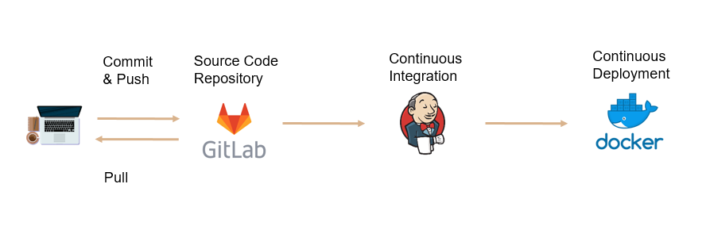
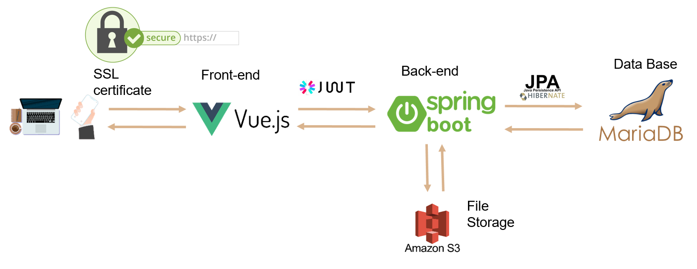


<details><summary>Frontend 자세히</summary><p>
    Vue.js
</p></details>
<details><summary>Backend 자세히</summary><p>
    Java, Spring, JPA, MariaDB
    - JDK
        - 11
    - IDE
        - IntelliJ IDEA Ultimate
    - Spring Boot
        - 2.4.2
    - 빌드
        - Gradle
</p></details>


## 🚩 개발 목표
### 제 2의 인생을 시작하는 오팔 세대를 위한 라이프 스타일 공유 SNS


### 꽃보다 집
    - 취미를 배우거나 집에서 활동하기를 좋아하는 분들을 위한 서비스입니다.

### 청산별곡
    - 다른 사람과 함께 활동을 좋아하는 분들을 위한 서비스입니다.
    - 같은 관심사를 가진 사람들과 함께 그룹을 만들 수 있습니다.

### 워커홀릭
    - 자연과 함께 살고 싶은 로망이 있는 분들을 위한 카테고리입니다.
    - 지도를 통해 자신이 갔던 곳을 표시할 수 있습니다.

### 핵인싸
    - 은퇴 후 경제 활동에 대한 이야기를 나누고 싶은 분들을 위한 서비스입니다.
    - 일자리 정보와 복지 정보를 제공해줍니다.


## ⭐ 주요 기능

### Login & Sign up
    - 카카오톡을 이용한 간편 회원가입, 로그인
    - 닉네임 중복 체크

### 꽃보다 집 Category
    - 해쉬태그, 본문, 사진 업로드를 통해 피드 작성
    - 좋아요 / 좋아요 취소 기능
    - 최근 좋아요 개수에 따른 인기 게시물 추천 기능
    - 댓글 작성 기능
    - 무한스크롤 기능
    
### 핵인싸 Category
    - 해쉬태그, 그룹선택, 사진 업로드를 통해 피드 작성
    - 그룹 생성 및 가입 가능
    - 좋아요 / 좋아요 취소 기능
    - 최근 좋아요 개수 및 그룹 멤버 수에 따른 그룹 내의 인기 게시물 추천 기능
    - 댓글 작성 기능
    - 무한스크롤 기능

### 청산별곡 Category
    - 해쉬태그, 본문, 위치 태그, 사진 업로드를 통해 피드 작성
    - 좋아요 / 좋아요 취소 기능
    - 최근 좋아요 개수에 따른 인기있는 게시물의 위치 추천 기능
    - 댓글 작성 기능
    - 무한스크롤 기능

### 워커홀릭 Category
    - 해쉬태그, 본문, 사진 업로드를 통해 피드 작성
    - 좋아요 / 좋아요 취소 기능
    - 중장년층에 맞는 취업 사이트 정보 추천 기능
    - 댓글 작성 기능
    - 무한스크롤 기능

### My page
    - 팔로우 / 팔로워 숫자 확인
    - 프로필 본인을 구독하는 유저 확인 가능
    - 가입한 그룹 확인 및 탈퇴 기능
    - 프로필 본인이 작성한 게시물 확인 가능
    - 프로필 본인에게 온 알림 확인 가능

### 알림
    - 본인의 게시물에 좋아요가 눌렀을 때 알림 발송
    - 본인의 게시물에 댓글이 달렸을 때 알림 발송
    - 본인의 그룹에 유저가 가입했을 때 알림 발송
    - 본인을 팔로우 했을 때 알림 발송

### Search
    - 게시물의 내용 중 검색어가 포함된 게시물 조회 가능
    - 유저의 닉네임 중 검색어가 포함된 유저 조회 가능
    - 그룹명 중 검색어가 포함된 그룹 조회 가능
    - 검색어 입력시 자동완성 기능

### 자동완성
    - 자음과 모음이 입력 될 때마다 해당되는 낱말이 있으면 자동완성 추천

### System
    - 프로필 이미지 수정 가능
    - 유저 닉네임 수정 가능
    - 프로필 소개 수정 가능


## 👀 페이지 소개
#### 카테고리
```
꽃보다 집, 핵인싸, 청산별곡, 워커홀릭의 카테고리로 구성
```
##### 꽃보다 집


##### 꽃보다 집 게시물 작성 Form
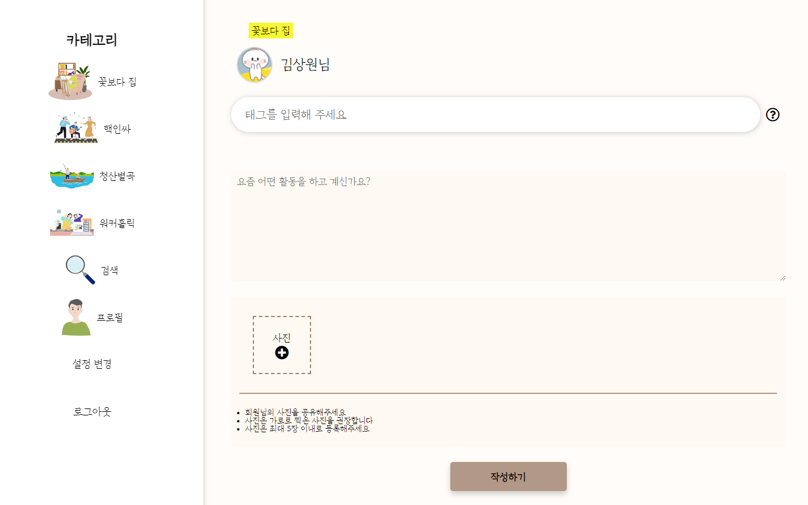

##### 핵인싸


##### 핵인싸 게시물 작성 Form


##### 청산별곡


##### 청산별곡 게시물 작성 Form


##### 워커홀릭


##### 워커홀릭 게시물 작성 Form
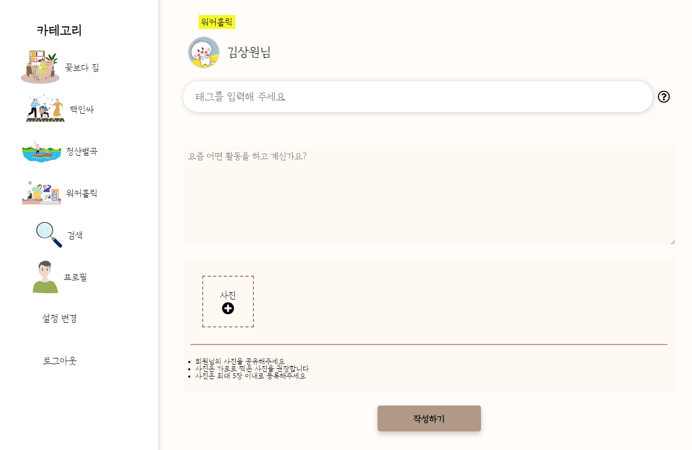


#### 프로필
```
프로필 주인의 게시물, 구독한 유저, 가입한 그룹, 알림(본인 계정일 경우)
```
##### 프로필에서 게시물 확인


##### 프로필에서 구독한 유저 확인
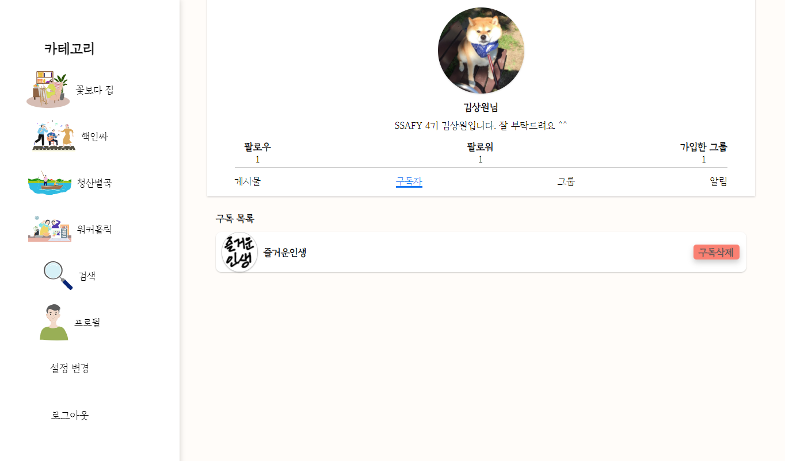

##### 프로필에서 가입한 그룹 확인


##### 프로필에서 알림 확인(본인 계정일 경우)
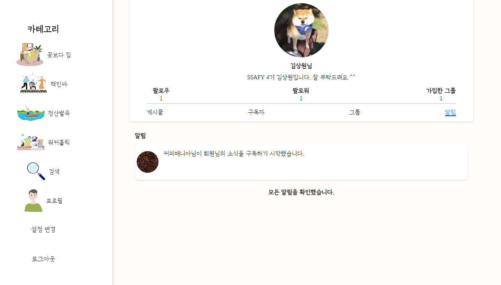


#### 설정변경
```
프로필 사진, 닉네임, 프로필 소개 변경 가능
```

##### 프로필 변경
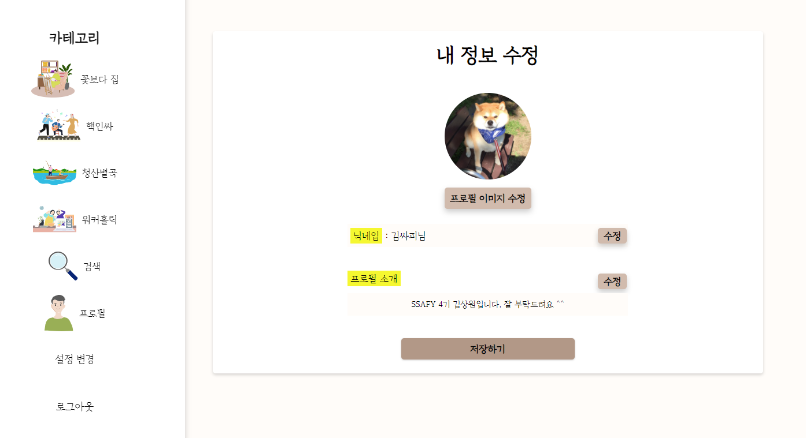


#### 검색
```
전체 검색, 게시물 검색, 유저 검색, 그룹 검색
```

##### 전체 검색
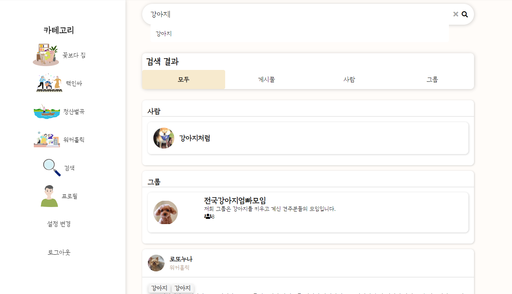

##### 게시물 검색
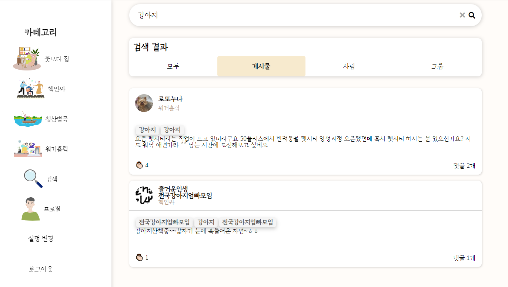

##### 유저 검색
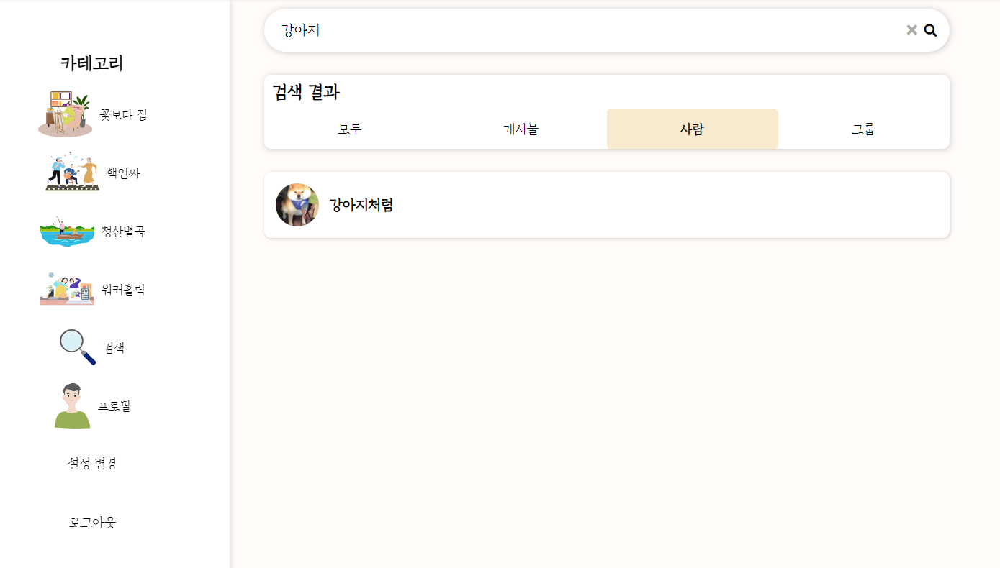

##### 그룹 검색
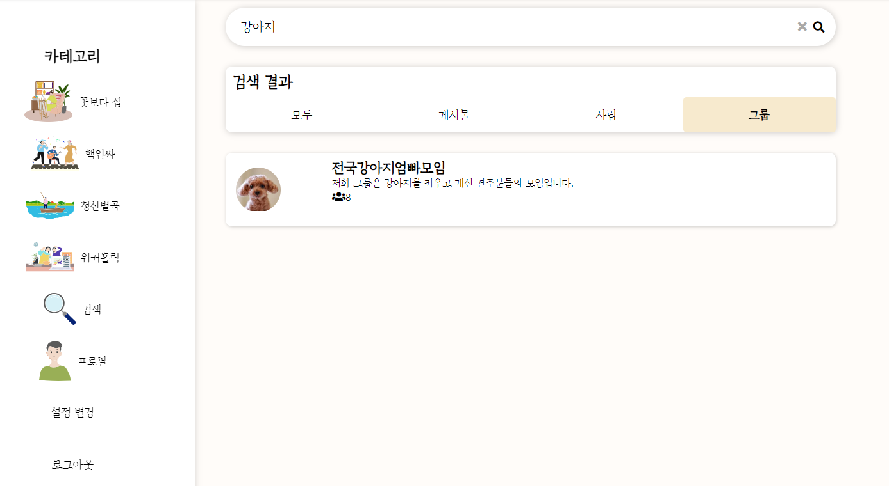


## 🎀 최종 산출물
- [최종발표 UCC](https://youtu.be/71-hPuw0H1g)

- [최종발표 PDF](산출물/3pm_최종.pdf)


## 🔐 Git 규칙

#### Branch
```
master -> develop -> feature/(branch name)_(FE/BE)
```

#### Merge
```
Merge 하기 전 Merge Request 이용.
Merge 후 Branch 삭제.
```

#### Commit

Commit template 추가 방법

> git config commit.template .gittemplate

```
# [타입, (fe/be)] 제목
# 제목은 최대 50 글자까지만 입력
#####################################


# 본문은 한 줄에 최대 72 글자까지만 입력
#####################################


# 꼬릿말은 아래에 작성: ex) 이슈 번호
#####################################

# --- COMMIT END ---
# [타입] 리스트
#   feat    : 기능 (새로운 기능)
#   fix     : 버그 (버그 수정)
#   refactor: 리팩토링
#   style   : 스타일 (코드 형식, 세미콜론 추가: 비즈니스 로직에 변경 없음)
#   docs    : 문서 (문서 추가, 수정, 삭제)
#   test    : 테스트 (테스트 코드 추가, 수정, 삭제: 비즈니스 로직에 변경 없음)
#   chore   : 기타 변경사항 (빌드 스크립트 수정 등)
# ------------------
#     제목 첫 글자를 대문자로
#     제목은 명령문으로
#     제목 끝에 마침표(.) 금지
#     제목과 본문을 한 줄 띄워 분리하기
#     본문은 "어떻게" 보다 "무엇을", "왜"를 설명한다.
#     본문에 여러줄의 메시지를 작성할 땐 "-"로 구분
# ------------------
```

## Frontend 개발 규칙
1. .vue 파일명 : 대문자 시작 + 카멜케이스
```
my page -> MyPage.vue
```

2. javascript 변수: 소문자 시작 + 카멜케이스
```
let myName
```

3. javascript 변수: 상수의 경우는 예외적으로 스네이크 케이스
```
let max_length
```

4. 클래스: 단어간 하이픈 사용, 대문자 사용 금지. 클래스 바인딩시에는 `-소문자` -> `대문자`로 변경
```
login-page
```

5. 링크 / url  : 백틱 사용
```
`https://www.naver.com`
```

6. 문자열 : 작은 따옴표 사용
```
let hellow = 'world'
```

7. 함수명 : 단일글자 및 줄임말 사용 금지, 이름만으로 함수의 용도가 파악될 수 있도록
   함수에는 한가지 기능만 넣으며 method의 길이가 10줄을 넘지 않도록 한다
```
setLogin () // (0)
lgn (), aa() // (x)
```

8. export 되는 상수 파일명은 모두 대문자
```
export const API_KEY
```

9. 시멘틱태그 준수?

10. 그외 commit 시 주의사항
1. 불필요한 console 삭제
2. 불필요한 주석 삭제
3. 들여쓰기 2칸
4. 문장 끝 세미콜론(;)


## Backend 개발 규칙
### 1. Package 구조
- controller
- service
- domian
- repository

### 2. 포매팅
#### 1.1 중괄호
- 시작하는 중괄호는 새로운 라인에 시작하지 않고 제어문과 같은 라인을 사용한다.
```
if (superHero == theTick) {
    System.out.println("Spoon!");   
}
```

- 제어문이 한 줄이더라도 중괄호를 생락하지 않는다.
```
if (superHero == theTick) {
        System.out.println("Spoon!");
}
```

#### 1.2 띄어쓰기
- 메소드 이름 다음에는 띄어쓰기 없이 왼쪽 괄호를 사용 // foo(i, j)
- 배열 다음에는 띄어쓰기 없이 왼쪽 괄호를 사용 // args[0]
- 이진 연산자 간에는 양쪽에 띄어쓰기를 사용 // a = b + c
- 쉼표와 세미콜론 뒤에는 띄어쓰기를 사용 // for (int i = 0; i < 10; i++)
- cast 사용시 띄어쓰기 없이 작성 // (MyClass)v.get(3)
- if, while, for, switch, catch 문 뒤에는 띄어쓰기를 사용 // if (check)


#### 1.3 클래스 멤버 정렬
- 클래스 멤버는 필드, 생성자, 메소드 순서로 정렬한다.


#### 1.4 라인 최대 길이
- 120칸을 넘지 않는다. (Intellij 기준)


### 2. 네이밍
#### 2.1 클래스와 인터페이스명
- 각 단어의 첫 글자는 대문자로 나머지는 소문자를 사용 // Customer, SalesOrder

#### 2.2 패키지명
- 소문자만 사용
- 복합단어를 사용하지 않는다.

### 3. 코딩
#### 3.1 피해야할 상황
- do-while 사용하지 않는다.
- 한 메소드에 한 reutrn, 마지막에 return

#### 3.2 증감 연산자
- 증감 연산자는 분리된 라인에서 단독으로 사용한다.

#### 3.3 초기화
- 변수가 사용되는 곳의 가까운 위치에 변수를 선언

#### 3.4 접근
- 상수를 제외한 모든 필드는 private 해야한다.
