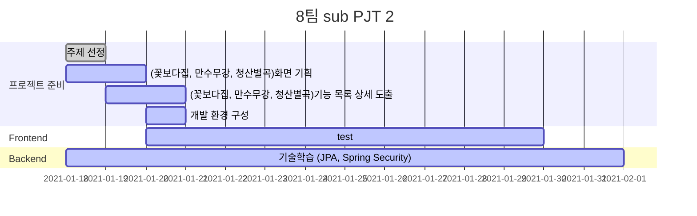

# 팀명
- 팀명 :
- 팀원 소개
  팀장 : 김상원
  팀원 : 명도균, 박성호, 이병훈, 장수민, 차민석

## Gantt




## 주제
- 프로젝트명
- 설명입력

## 기술스택
- Frontend

  Vue.js, Vuetify

- Backend

  Java, Spring, JPA, MariaDB

## 기능
- 기능1
    - 세부기능1
    - 세부기능2
- 기능2
    - 세부기능1
    - 세부기능2
- 기능3
    - 세부기능1
    - 세부기능2

## 개발규칙

#### Branch
```
master -> develop -> feature/(branch name)
```

#### Merge
```
Merge 하기 전 Merge Request 이용.
Merge 후 Branch 삭제.
```

#### commit
```
# [타입, (fe/be)] 제목
# 제목은 최대 50 글자까지만 입력
#####################################


# 본문은 한 줄에 최대 72 글자까지만 입력
#####################################


# 꼬릿말은 아래에 작성: ex) 이슈 번호
#####################################

# --- COMMIT END ---
# [타입] 리스트
#   feat    : 기능 (새로운 기능)
#   fix     : 버그 (버그 수정)
#   refactor: 리팩토링
#   style   : 스타일 (코드 형식, 세미콜론 추가: 비즈니스 로직에 변경 없음)
#   docs    : 문서 (문서 추가, 수정, 삭제)
#   test    : 테스트 (테스트 코드 추가, 수정, 삭제: 비즈니스 로직에 변경 없음)
#   chore   : 기타 변경사항 (빌드 스크립트 수정 등)
# ------------------
#     제목 첫 글자를 대문자로
#     제목은 명령문으로
#     제목 끝에 마침표(.) 금지
#     제목과 본문을 한 줄 띄워 분리하기
#     본문은 "어떻게" 보다 "무엇을", "왜"를 설명한다.
#     본문에 여러줄의 메시지를 작성할 땐 "-"로 구분
# ------------------
```