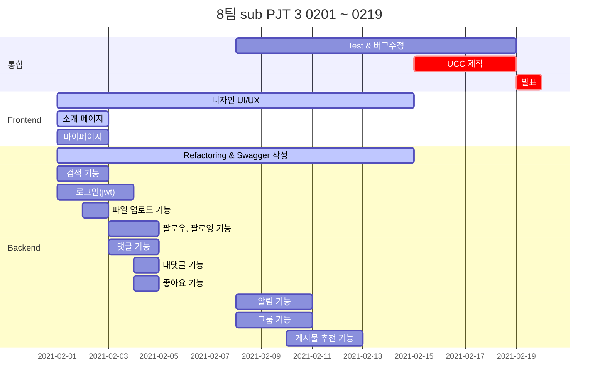

# 팀명

- 팀명 : 상원없는 상원팀
- 팀원 소개

| 이름 | 직책 | 역할
| --- | --- | --- |
| 김상원 | 팀장 | Backend, QA |
| 명도균 | 팀원 | Frontend, 기획 |
| 박성호 | 팀원 | Backend, Git master |
| 이병훈 | 팀원 | Frontend, 테크리더 |
| 장수민 | 팀원 | Frontend, 기획 |
| 차민석 | 팀원 | Backend, 테크리더 |

## Gantt



## 주제

- 프로젝트명
 
    > 오후세시
    
- 의미

    - 중장년층의 시간이 오후 3시
    
    - '오늘도 후회없는 세(새)인생 시작'

- 설명입력

    > 중,장년층을 위한 라이프스타일 맞춤형 SNS

## 기술스택

### Frontend

  Vue.js, Vuetify

### Backend

#### 기술스택
    
    Java, Spring, JPA, MariaDB

#### 개발 환경

- JDK
    - 11
    
- IDE
    - IntelliJ IDEA Ultimate

- Spring Boot
    - 2.4.2
    
- 빌드
    - Gradle

## 기능

- 기본 기능

    - 카카오톡을 이용한 회원가입, 로그인
    
    - 마이페이지 기능

- 개인 SNS 기능

    - 게시물 작성

    - 댓글, 답글 작성
    
    - 좋아요 기능
    
    - 팔로워, 팔로잉 기능

    - 태그를 이용한 검색
    
    - 사진, 동영상 업로드
    
    - 좋아요, 댓글, 팔로잉 알림 기능
    
    - 게시물 추천 기능
    
- 그룹 SNS 기능

    - 그룹 가입하여 그룹 내에서 소통

    - 그룹 내 게시물 작성


## Database 구조


## Git 규칙

#### Branch
```
master -> develop -> feature/(branch name)_(FE/BE)
```

#### Merge
```
Merge 하기 전 Merge Request 이용.
Merge 후 Branch 삭제.
```

#### Commit

Commit template 추가 방법

> git config commit.template .gittemplate

```
# [타입, (fe/be)] 제목
# 제목은 최대 50 글자까지만 입력
#####################################


# 본문은 한 줄에 최대 72 글자까지만 입력
#####################################


# 꼬릿말은 아래에 작성: ex) 이슈 번호
#####################################

# --- COMMIT END ---
# [타입] 리스트
#   feat    : 기능 (새로운 기능)
#   fix     : 버그 (버그 수정)
#   refactor: 리팩토링
#   style   : 스타일 (코드 형식, 세미콜론 추가: 비즈니스 로직에 변경 없음)
#   docs    : 문서 (문서 추가, 수정, 삭제)
#   test    : 테스트 (테스트 코드 추가, 수정, 삭제: 비즈니스 로직에 변경 없음)
#   chore   : 기타 변경사항 (빌드 스크립트 수정 등)
# ------------------
#     제목 첫 글자를 대문자로
#     제목은 명령문으로
#     제목 끝에 마침표(.) 금지
#     제목과 본문을 한 줄 띄워 분리하기
#     본문은 "어떻게" 보다 "무엇을", "왜"를 설명한다.
#     본문에 여러줄의 메시지를 작성할 땐 "-"로 구분
# ------------------
```

## Frontend 개발 규칙


1. .vue 파일명 : 대문자 시작 + 카멜케이스

```
my page -> MyPage.vue
```


2. javascript 변수: 소문자 시작 + 카멜케이스

```
let myName
```


3. javascript 변수: 상수의 경우는 예외적으로 스네이크 케이스

```
let max_length
```


4. 클래스: 단어간 하이픈 사용, 대문자 사용 금지. 클래스 바인딩시에는 `-소문자` -> `대문자`로 변경

```
login-page
```


5. 링크 / url  : 백틱 사용

```
`https://www.naver.com`
```


6. 문자열 : 작은 따옴표 사용

```
let hellow = 'world'
```


7. 함수명 : 단일글자 및 줄임말 사용 금지, 이름만으로 함수의 용도가 파악될 수 있도록

   함수에는 한가지 기능만 넣으며 method의 길이가 10줄을 넘지 않도록 한다

```
setLogin () // (0)
lgn (), aa() // (x)
```


8. export 되는 상수 파일명은 모두 대문자

```
export const API_KEY
```


9. 시멘틱태그 준수?


10. 그외 commit 시 주의사항

1. 불필요한 console 삭제
2. 불필요한 주석 삭제
3. 들여쓰기 2칸
4. 문장 끝 세미콜론(;)

## Backend 개발 규칙

### 1. Package 구조

- controller

- service

- domian

- repository
 

### 2. 포매팅

#### 1.1 중괄호

- 시작하는 중괄호는 새로운 라인에 시작하지 않고 제어문과 같은 라인을 사용한다.

```
if (superHero == theTick) {
    System.out.println("Spoon!");   
}
```

- 제어문이 한 줄이더라도 중괄호를 생락하지 않는다.

```
if (superHero == theTick) {
        System.out.println("Spoon!");
}
```

#### 1.2 띄어쓰기

- 메소드 이름 다음에는 띄어쓰기 없이 왼쪽 괄호를 사용 // foo(i, j)

- 배열 다음에는 띄어쓰기 없이 왼쪽 괄호를 사용 // args[0]

- 이진 연산자 간에는 양쪽에 띄어쓰기를 사용 // a = b + c

- 쉼표와 세미콜론 뒤에는 띄어쓰기를 사용 // for (int i = 0; i < 10; i++)

- cast 사용시 띄어쓰기 없이 작성 // (MyClass)v.get(3)

- if, while, for, switch, catch 문 뒤에는 띄어쓰기를 사용 // if (check)


#### 1.3 클래스 멤버 정렬

- 클래스 멤버는 필드, 생성자, 메소드 순서로 정렬한다.


#### 1.4 라인 최대 길이

- 120칸을 넘지 않는다. (Intellij 기준)


### 2. 네이밍

#### 2.1 클래스와 인터페이스명

- 각 단어의 첫 글자는 대문자로 나머지는 소문자를 사용 // Customer, SalesOrder

#### 2.2 패키지명

- 소문자만 사용
 
- 복합단어를 사용하지 않는다.

### 3. 코딩

#### 3.1 피해야할 상황

- do-while 사용하지 않는다.

- 한 메소드에 한 reutrn, 마지막에 return

#### 3.2 증감 연산자

- 증감 연산자는 분리된 라인에서 단독으로 사용한다.

#### 3.3 초기화

- 변수가 사용되는 곳의 가까운 위치에 변수를 선언

#### 3.4 접근

- 상수를 제외한 모든 필드는 private 해야한다.
